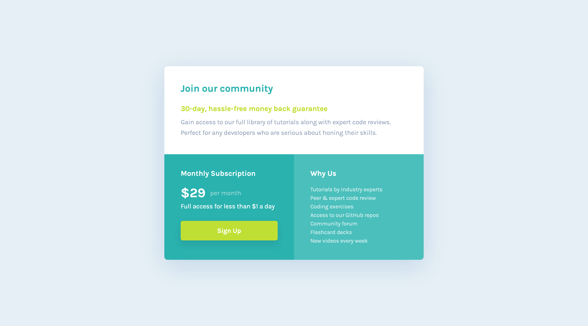

# Frontend Mentor - Single price grid component solution
This is a solution to the [Single price grid component challenge on Frontend Mentor](https://www.frontendmentor.io/challenges/single-price-grid-component-5ce41129d0ff452fec5abbbc). Frontend Mentor challenges help you improve your coding skills by building realistic projects. 

### The challenge
Users should be able to:

- View the optimal layout for the component depending on their device's screen size
- See a hover state on desktop for the Sign Up call-to-action

### Screenshot

### Links

- Solution URL: [click here](https://github.com/antonistarzynski/single-grid-component)
- Live Site URL: [click here](https://antonistarzynski.github.io/single-grid-component/)

### Built with

- Semantic HTML5 markup
- CSS custom properties
- Flexbox
- CSS Grid
- Mobile-first workflow

## Author

- Website - [antoni.works](https://antoni.works)
- Frontend Mentor - [@antonistarzynski](https://www.frontendmentor.io/profile/antonistarzynski)
- Instagram - [@antek.s](https://www.instagram.com/antek.s/)

